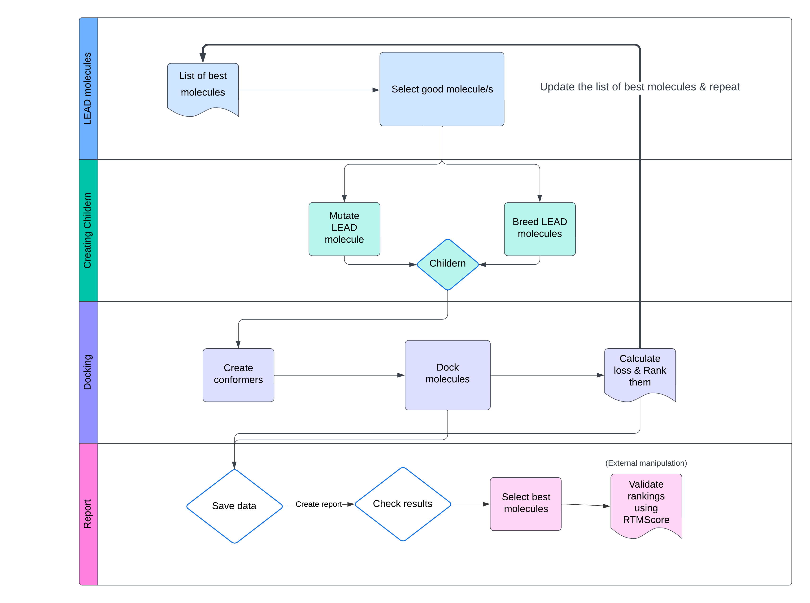

# Evo FLOPA: Evolutionary Fast Lead OPtimization Algorithm

This project utilising CUDA and robust SELFIE representation of molecules can create new improved versions of them efficiently.

## Overview

The pipeline follows these steps:

1. **Generate Molecules**: Use the modified STONED algorithm to mutate or combine molecules encoded as SELFIE strings.
2. **Docking Simulation**: Evaluate molecules using UniDock on CUDA to determine binding affinities to a target receptor.
3. **Scoring**: Calculate a loss function combining docking scores and molecular properties (e.g., SA, QED).
4. **Selection**: Retain the best molecules to seed the next iteration.
5. **Report Generation**: Create visualizations and reports of molecule properties and optimization progress.



## Prerequisites

- **Docker**: Build docker from `Dockerfile`.

- **Conda** Install in as Conda enviroment by running `conda env create -f env.yml`

## Quick Start

### 1. Build the Docker Image

Navigate to the project directory (where the `Dockerfile` is located) and run:

```bash
docker build -t stocking_app .
```

### 2. Run the Container

Launch the Docker container:

```bash
docker run -it --rm --gpus all -v $(pwd):/app/ stocking_app
```

Once inside the container, execute the main script:

```bash
python3 src/main.py -ls examples/TrmD/compounds/Compound*.sdf -r examples/TrmD/raw_4yvg.pdbqt -cx 45 -cy 5 -cz 10 --num_iterations=2000 --num_variants=32 --num_confs=3 -en="experiments/main_run_2000_iter_take_3" -dt 3 -tnh 128 --breed --breeding_prob=0.3 --temp=0.8 --min_allowed_cycle_size=3 --max_allowed_cycle_size=11 -sf "vinardo" -ex 384 -ms 40 -conf=src/config.json
```

### 3. View Results

Results, including reports and plots, will be saved in the experiment directory you specify (e.g., `experiments/main_run_2000_iter_take_3`).

## Customization

You can adjust the script parameters to suit your needs. Key arguments include:

- **Input files**: `-ls` (ligands), `-r` (receptor).
- **Docking settings**: `-cx`, `-cy`, `-cz` (box center), `-ex` (exhaustiveness).
- **Iteration control**: `--num_iterations`, `--num_variants`.
- **Output**: `-en` (experiment name/directory).

For more options, run:

```bash
python3 src/main.py --help
```

## Additional Notes

- **Configurable Scoring**: Modify `config.json` to adjust weights for SA, QED, and docking scores.
- **GPU Acceleration**: Requires a CUDA-enabled system and the `--gpus all` flag. For CPU-only systems, remove `--gpus all`.

## Project Structure

```plaintext
├── additional_scripts/
│   └── gen_report.py          # Generates optimization reports.
├── examples/
│   └── TrmD/                 # Example input data.
│       ├── compounds/        # Example ligands.
│       └── raw_4yvg.pdbqt    # Example receptor file.
├── src/
│   ├── config.py             # Configuration loader.
│   ├── loss.py               # Loss function definitions.
│   ├── main.py               # Main script for optimization.
│   ├── stoned.py             # STONED algorithm implementation.
│   ├── utils.py              # Utility functions.
├── Dockerfile                # Docker image definition.
├── env.yml                   # Conda environment file.
└── README.md                 # This README.
```

## License

GPL-3.0
